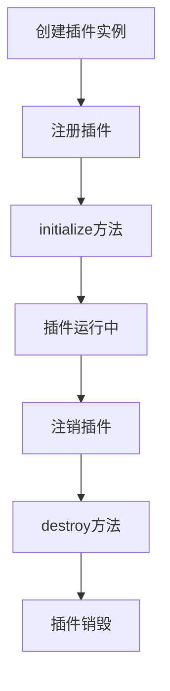

# PDF查看器插件开发指南

## 目录
1. [快速开始](#快速开始)
2. [插件基础概念](#插件基础概念)
3. [核心API参考](#核心api参考)
4. [插件开发实战](#插件开发实战)
5. [最佳实践](#最佳实践)
6. [调试和测试](#调试和测试)
7. [发布和分发](#发布和分发)

## 快速开始

### 创建你的第一个插件

```typescript
// src/plugins/MyFirstPlugin.ts
import { ReactPDF } from '../types/pdf-core';

export class MyFirstPlugin implements ReactPDF.Plugin {
  name = 'my-first-plugin';
  version = '1.0.0';
  
  private context!: ReactPDF.PluginContext;

  async initialize(context: ReactPDF.PluginContext): Promise<void> {
    this.context = context;
    
    // 注册命令
    context.registerCommand('my-first-plugin:hello', this.sayHello.bind(this));
    
    // 监听事件
    context.eventBus.on('document:opened', this.onDocumentOpened.bind(this));
    
    console.log('MyFirstPlugin initialized!');
  }

  async destroy(): Promise<void> {
    this.context.unregisterCommand('my-first-plugin:hello');
    console.log('MyFirstPlugin destroyed!');
  }

  private async sayHello(): Promise<string> {
    return 'Hello from my first plugin!';
  }

  private onDocumentOpened(event: any): void {
    console.log('Document opened:', event.documentId);
  }
}
```

### 注册插件

```typescript
// 在PdfViewerV2.tsx中注册
import { MyFirstPlugin } from '../../plugins/MyFirstPlugin';

// 在useEffect中
const myPlugin = new MyFirstPlugin();
await pluginManager.registerPlugin(myPlugin);
```

### 使用插件

```typescript
// 获取插件实例
const myPlugin = pluginManager.getPlugin<MyFirstPlugin>('my-first-plugin');

// 执行命令
const result = await pluginManager.getPluginContext()
  .executeCommand('my-first-plugin:hello');
console.log(result); // "Hello from my first plugin!"
```

## 插件基础概念

### 插件生命周期



### 核心组件关系

```typescript
// 插件上下文提供的核心组件
interface PluginContext {
  documentManager: DocumentManager;  // PDF文档管理
  eventBus: EventBus;               // 事件通信
  stateManager: StateManager;       // 状态管理
  registerCommand: Function;        // 命令注册
  unregisterCommand: Function;      // 命令注销
}
```

## 核心API参考

### DocumentManager API

```typescript
// 文档操作
const handle = await context.documentManager.openFromPath('/path/to/file.pdf');
await context.documentManager.close(documentId);

// 页面操作
const pageHandle = await context.documentManager.loadPage(documentId, pageIndex);
const textPageHandle = await context.documentManager.loadTextPage(pageHandle);

// 文本操作
const text = await context.documentManager.getTextInRange(textPageHandle, start, count);
```

### EventBus API

```typescript
// 监听事件
context.eventBus.on('document:opened', (event) => {
  console.log('Document opened:', event.documentId);
});

// 发射事件
context.eventBus.emit('my-plugin:action', { data: 'some data' });

// 移除监听器
context.eventBus.off('document:opened', handler);
```

### StateManager API

```typescript
// 设置状态
context.stateManager.setState('my-plugin:config', { theme: 'dark' });

// 获取状态
const config = context.stateManager.getState('my-plugin:config');

// 订阅状态变化
const unsubscribe = context.stateManager.subscribe('my-plugin:config', (newConfig) => {
  console.log('Config changed:', newConfig);
});

// 取消订阅
unsubscribe();
```

### Command System API

```typescript
// 注册命令
context.registerCommand('my-plugin:action', async (param1, param2) => {
  // 命令执行逻辑
  return { result: 'success', data: param1 + param2 };
});

// 执行命令
const result = await context.executeCommand('my-plugin:action', 'hello', 'world');
```

## 插件开发实战

### 示例1: 书签管理插件

```typescript
// src/plugins/BookmarkPlugin.ts
import { ReactPDF, PDFEvents } from '../types/pdf-core';

interface Bookmark {
  id: string;
  title: string;
  pageIndex: number;
  createdAt: Date;
}

export class BookmarkPlugin implements ReactPDF.Plugin {
  name = 'bookmarks';
  version = '1.0.0';
  
  private context!: ReactPDF.PluginContext;
  private bookmarks: Map<string, Bookmark[]> = new Map(); // documentId -> bookmarks

  async initialize(context: ReactPDF.PluginContext): Promise<void> {
    this.context = context;
    
    // 注册命令
    context.registerCommand('bookmarks:add', this.addBookmark.bind(this));
    context.registerCommand('bookmarks:remove', this.removeBookmark.bind(this));
    context.registerCommand('bookmarks:list', this.listBookmarks.bind(this));
    context.registerCommand('bookmarks:goto', this.gotoBookmark.bind(this));
    
    // 监听文档事件
    context.eventBus.on<PDFEvents.DocumentClosed>('document:closed', this.onDocumentClosed.bind(this));
    
    // 初始化状态
    context.stateManager.setState('bookmarks:current', null);
  }

  async destroy(): Promise<void> {
    // 清理命令
    this.context.unregisterCommand('bookmarks:add');
    this.context.unregisterCommand('bookmarks:remove');
    this.context.unregisterCommand('bookmarks:list');
    this.context.unregisterCommand('bookmarks:goto');
    
    // 清理状态
    this.bookmarks.clear();
  }

  private async addBookmark(documentId: string, pageIndex: number, title?: string): Promise<Bookmark> {
    if (!this.bookmarks.has(documentId)) {
      this.bookmarks.set(documentId, []);
    }
    
    const bookmark: Bookmark = {
      id: `bookmark_${Date.now()}`,
      title: title || `页面 ${pageIndex + 1}`,
      pageIndex,
      createdAt: new Date()
    };
    
    this.bookmarks.get(documentId)!.push(bookmark);
    
    // 发射事件
    this.context.eventBus.emit('bookmarks:added', { bookmark, documentId });
    
    return bookmark;
  }

  private async removeBookmark(documentId: string, bookmarkId: string): Promise<boolean> {
    const bookmarks = this.bookmarks.get(documentId);
    if (!bookmarks) return false;
    
    const index = bookmarks.findIndex(b => b.id === bookmarkId);
    if (index === -1) return false;
    
    const removed = bookmarks.splice(index, 1)[0];
    
    // 发射事件
    this.context.eventBus.emit('bookmarks:removed', { bookmark: removed, documentId });
    
    return true;
  }

  private async listBookmarks(documentId: string): Promise<Bookmark[]> {
    return this.bookmarks.get(documentId) || [];
  }

  private async gotoBookmark(bookmarkId: string): Promise<void> {
    // 找到书签
    let targetBookmark: Bookmark | null = null;
    let targetDocumentId: string | null = null;
    
    for (const [documentId, bookmarks] of this.bookmarks) {
      const bookmark = bookmarks.find(b => b.id === bookmarkId);
      if (bookmark) {
        targetBookmark = bookmark;
        targetDocumentId = documentId;
        break;
      }
    }
    
    if (targetBookmark && targetDocumentId) {
      // 发射跳转事件
      this.context.eventBus.emit('navigation:goto', {
        documentId: targetDocumentId,
        pageIndex: targetBookmark.pageIndex
      });
    }
  }

  private onDocumentClosed(event: PDFEvents.DocumentClosed): void {
    // 清理文档的书签
    this.bookmarks.delete(event.documentId);
  }
}
```

### 示例2: 搜索插件

```typescript
// src/plugins/SearchPlugin.ts
import { ReactPDF, PDFEvents } from '../types/pdf-core';

interface SearchResult {
  pageIndex: number;
  charIndex: number;
  length: number;
  text: string;
  context: string; // 上下文文本
}

export class SearchPlugin implements ReactPDF.SearchPlugin {
  name = 'search';
  version = '1.0.0';
  
  private context!: ReactPDF.PluginContext;
  private currentResults: SearchResult[] = [];
  private currentQuery: string = '';

  async initialize(context: ReactPDF.PluginContext): Promise<void> {
    this.context = context;
    
    // 注册命令
    context.registerCommand('search:find', this.search.bind(this));
    context.registerCommand('search:next', this.findNext.bind(this));
    context.registerCommand('search:previous', this.findPrevious.bind(this));
    context.registerCommand('search:clear', this.clearSearch.bind(this));
    
    // 初始化状态
    context.stateManager.setState('search:results', []);
    context.stateManager.setState('search:currentIndex', -1);
  }

  async destroy(): Promise<void> {
    this.context.unregisterCommand('search:find');
    this.context.unregisterCommand('search:next');
    this.context.unregisterCommand('search:previous');
    this.context.unregisterCommand('search:clear');
    
    this.clearSearch();
  }

  async search(documentId: string, query: string, options?: ReactPDF.SearchOptions): Promise<ReactPDF.SearchResult[]> {
    this.currentQuery = query;
    this.currentResults = [];
    
    if (!query.trim()) {
      this.updateSearchState();
      return [];
    }
    
    try {
      // 获取文档信息
      const metadata = this.context.documentManager.getLegacyMetadata(documentId);
      if (!metadata) throw new Error('Document not found');
      
      // 搜索所有页面
      for (let pageIndex = 0; pageIndex < metadata.total_pages; pageIndex++) {
        const pageResults = await this.searchInPage(documentId, pageIndex, query, options);
        this.currentResults.push(...pageResults);
        
        // 限制结果数量
        if (options?.maxResults && this.currentResults.length >= options.maxResults) {
          this.currentResults = this.currentResults.slice(0, options.maxResults);
          break;
        }
      }
      
      this.updateSearchState();
      
      // 发射搜索完成事件
      this.context.eventBus.emit<PDFEvents.SearchCompleted>('search:completed', {
        query,
        results: this.currentResults
      });
      
      return this.currentResults.map(r => ({
        pageIndex: r.pageIndex,
        charIndex: r.charIndex,
        length: r.length,
        text: r.text,
        rect: new DOMRect(0, 0, 0, 0) // 需要实际计算位置
      }));
    } catch (error) {
      console.error('Search failed:', error);
      return [];
    }
  }

  private async searchInPage(
    documentId: string,
    pageIndex: number,
    query: string,
    options?: ReactPDF.SearchOptions
  ): Promise<SearchResult[]> {
    try {
      // 加载页面和文本
      const pageHandle = await this.context.documentManager.loadPage(documentId, pageIndex);
      const textPageHandle = await this.context.documentManager.loadTextPage(pageHandle);
      
      // 获取页面全部文本
      const fullText = await this.context.documentManager.getTextInRange(
        textPageHandle, 0, textPageHandle.charCount
      );
      
      const results: SearchResult[] = [];
      const searchQuery = options?.caseSensitive ? query : query.toLowerCase();
      const searchText = options?.caseSensitive ? fullText : fullText.toLowerCase();
      
      let startIndex = 0;
      while (true) {
        let foundIndex: number;
        
        if (options?.regex) {
          const regex = new RegExp(searchQuery, options.caseSensitive ? 'g' : 'gi');
          const match = regex.exec(searchText.slice(startIndex));
          if (!match) break;
          foundIndex = startIndex + match.index;
        } else {
          foundIndex = searchText.indexOf(searchQuery, startIndex);
          if (foundIndex === -1) break;
        }
        
        // 检查整词匹配
        if (options?.wholeWord) {
          const before = foundIndex > 0 ? searchText[foundIndex - 1] : ' ';
          const after = foundIndex + query.length < searchText.length ? 
            searchText[foundIndex + query.length] : ' ';
          
          if (/\w/.test(before) || /\w/.test(after)) {
            startIndex = foundIndex + 1;
            continue;
          }
        }
        
        // 提取上下文
        const contextStart = Math.max(0, foundIndex - 50);
        const contextEnd = Math.min(fullText.length, foundIndex + query.length + 50);
        const context = fullText.slice(contextStart, contextEnd);
        
        results.push({
          pageIndex,
          charIndex: foundIndex,
          length: query.length,
          text: fullText.slice(foundIndex, foundIndex + query.length),
          context
        });
        
        startIndex = foundIndex + 1;
      }
      
      return results;
    } catch (error) {
      console.error(`Failed to search in page ${pageIndex}:`, error);
      return [];
    }
  }

  highlightResults(results: ReactPDF.SearchResult[]): void {
    // 发射高亮事件
    this.context.eventBus.emit('search:highlight', { results });
  }

  clearHighlights(): void {
    this.context.eventBus.emit('search:clearHighlights', {});
  }

  private async findNext(): Promise<SearchResult | null> {
    if (this.currentResults.length === 0) return null;
    
    const currentIndex = this.context.stateManager.getState<number>('search:currentIndex') || -1;
    const nextIndex = (currentIndex + 1) % this.currentResults.length;
    
    this.context.stateManager.setState('search:currentIndex', nextIndex);
    
    const result = this.currentResults[nextIndex];
    this.context.eventBus.emit('search:navigate', { result, index: nextIndex });
    
    return result;
  }

  private async findPrevious(): Promise<SearchResult | null> {
    if (this.currentResults.length === 0) return null;
    
    const currentIndex = this.context.stateManager.getState<number>('search:currentIndex') || 0;
    const prevIndex = currentIndex === 0 ? this.currentResults.length - 1 : currentIndex - 1;
    
    this.context.stateManager.setState('search:currentIndex', prevIndex);
    
    const result = this.currentResults[prevIndex];
    this.context.eventBus.emit('search:navigate', { result, index: prevIndex });
    
    return result;
  }

  private clearSearch(): void {
    this.currentResults = [];
    this.currentQuery = '';
    this.updateSearchState();
    this.clearHighlights();
  }

  private updateSearchState(): void {
    this.context.stateManager.setState('search:results', this.currentResults);
    this.context.stateManager.setState('search:currentIndex', -1);
  }
}
```

### 示例3: 注释插件

```typescript
// src/plugins/AnnotationPlugin.ts
import { ReactPDF, PDFEvents } from '../types/pdf-core';

export class AnnotationPlugin implements ReactPDF.AnnotationPlugin {
  name = 'annotations';
  version = '1.0.0';
  
  private context!: ReactPDF.PluginContext;
  private annotations: Map<string, ReactPDF.Annotation[]> = new Map();

  async initialize(context: ReactPDF.PluginContext): Promise<void> {
    this.context = context;
    
    // 注册命令
    context.registerCommand('annotations:create', this.createAnnotation.bind(this));
    context.registerCommand('annotations:update', this.updateAnnotation.bind(this));
    context.registerCommand('annotations:remove', this.removeAnnotation.bind(this));
    context.registerCommand('annotations:list', this.getAllAnnotations.bind(this));
    context.registerCommand('annotations:listByPage', this.getPageAnnotations.bind(this));
    
    // 监听文档事件
    context.eventBus.on<PDFEvents.DocumentClosed>('document:closed', this.onDocumentClosed.bind(this));
  }

  async destroy(): Promise<void> {
    // 清理命令
    const commands = ['create', 'update', 'remove', 'list', 'listByPage'];
    commands.forEach(cmd => {
      this.context.unregisterCommand(`annotations:${cmd}`);
    });
    
    this.annotations.clear();
  }

  async getAllAnnotations(documentId: string): Promise<ReactPDF.Annotation[]> {
    return this.annotations.get(documentId) || [];
  }

  async getPageAnnotations(documentId: string, pageIndex: number): Promise<ReactPDF.Annotation[]> {
    const allAnnotations = this.annotations.get(documentId) || [];
    return allAnnotations.filter(annotation => annotation.pageIndex === pageIndex);
  }

  async createAnnotation(
    documentId: string,
    pageIndex: number,
    annotationData: ReactPDF.AnnotationData
  ): Promise<ReactPDF.Annotation> {
    const annotation: ReactPDF.Annotation = {
      id: `annotation_${Date.now()}_${Math.random().toString(36).substr(2, 9)}`,
      type: annotationData.type || ReactPDF.AnnotationType.NOTE,
      pageIndex,
      rect: annotationData.rect || new DOMRect(0, 0, 100, 100),
      data: annotationData,
      createdAt: new Date(),
      updatedAt: new Date()
    };
    
    if (!this.annotations.has(documentId)) {
      this.annotations.set(documentId, []);
    }
    
    this.annotations.get(documentId)!.push(annotation);
    
    // 发射事件
    this.context.eventBus.emit<PDFEvents.AnnotationCreated>('annotation:created', { annotation });
    
    return annotation;
  }

  async updateAnnotation(annotationId: string, updates: Partial<ReactPDF.AnnotationData>): Promise<ReactPDF.Annotation> {
    // 查找注释
    let targetAnnotation: ReactPDF.Annotation | null = null;
    
    for (const [documentId, annotations] of this.annotations) {
      const annotation = annotations.find(a => a.id === annotationId);
      if (annotation) {
        // 更新注释
        annotation.data = { ...annotation.data, ...updates };
        annotation.updatedAt = new Date();
        targetAnnotation = annotation;
        break;
      }
    }
    
    if (!targetAnnotation) {
      throw new Error(`Annotation ${annotationId} not found`);
    }
    
    // 发射事件
    this.context.eventBus.emit<PDFEvents.AnnotationUpdated>('annotation:updated', { annotation: targetAnnotation });
    
    return targetAnnotation;
  }

  async removeAnnotation(annotationId: string): Promise<void> {
    // 查找并删除注释
    for (const [documentId, annotations] of this.annotations) {
      const index = annotations.findIndex(a => a.id === annotationId);
      if (index !== -1) {
        annotations.splice(index, 1);
        
        // 发射事件
        this.context.eventBus.emit<PDFEvents.AnnotationDeleted>('annotation:deleted', { annotationId });
        return;
      }
    }
    
    throw new Error(`Annotation ${annotationId} not found`);
  }

  private onDocumentClosed(event: PDFEvents.DocumentClosed): void {
    // 清理文档的注释
    this.annotations.delete(event.documentId);
  }
}
```

## 最佳实践

### 1. 插件命名规范

```typescript
// ✅ 好的命名
export class TextSelectionPlugin implements ReactPDF.TextSelectionPlugin {
  name = 'text-selection';  // kebab-case
  version = '1.0.0';        // 语义化版本
}

// ❌ 避免的命名
export class textSelection {
  name = 'TextSelection';   // 不要使用PascalCase
  version = '1';            // 不要使用简单数字
}
```

### 2. 错误处理

```typescript
export class MyPlugin implements ReactPDF.Plugin {
  async initialize(context: ReactPDF.PluginContext): Promise<void> {
    try {
      // 插件初始化逻辑
      await this.setupPlugin(context);
    } catch (error) {
      // 发射错误事件
      context.eventBus.emit('error', {
        plugin: this.name,
        error: error.message,
        context: 'initialization'
      });
      throw error; // 重新抛出，让插件管理器处理
    }
  }

  private async executeCommand(action: string): Promise<any> {
    try {
      return await this.performAction(action);
    } catch (error) {
      console.error(`Command ${action} failed in ${this.name}:`, error);
      throw new Error(`Plugin ${this.name}: ${error.message}`);
    }
  }
}
```

### 3. 资源清理

```typescript
export class ResourceIntensivePlugin implements ReactPDF.Plugin {
  private workers: Worker[] = [];
  private timers: NodeJS.Timeout[] = [];
  private subscriptions: (() => void)[] = [];

  async initialize(context: ReactPDF.PluginContext): Promise<void> {
    // 创建资源时记录
    const worker = new Worker('/path/to/worker.js');
    this.workers.push(worker);
    
    const timer = setInterval(() => {}, 1000);
    this.timers.push(timer);
    
    const unsubscribe = context.stateManager.subscribe('key', () => {});
    this.subscriptions.push(unsubscribe);
  }

  async destroy(): Promise<void> {
    // 清理所有资源
    this.workers.forEach(worker => worker.terminate());
    this.timers.forEach(timer => clearInterval(timer));
    this.subscriptions.forEach(unsubscribe => unsubscribe());
    
    this.workers = [];
    this.timers = [];
    this.subscriptions = [];
  }
}
```

### 4. 状态管理

```typescript
export class StatefulPlugin implements ReactPDF.Plugin {
  private context!: ReactPDF.PluginContext;
  
  // 使用命名空间避免冲突
  private getStateKey(key: string): string {
    return `${this.name}:${key}`;
  }
  
  private setState<T>(key: string, value: T): void {
    this.context.stateManager.setState(this.getStateKey(key), value);
  }
  
  private getState<T>(key: string): T | undefined {
    return this.context.stateManager.getState<T>(this.getStateKey(key));
  }
  
  private subscribe<T>(key: string, callback: (value: T) => void): () => void {
    return this.context.stateManager.subscribe<T>(this.getStateKey(key), callback);
  }
}
```

### 5. 事件处理

```typescript
export class EventDrivenPlugin implements ReactPDF.Plugin {
  private eventHandlers: Map<string, Function[]> = new Map();
  
  async initialize(context: ReactPDF.PluginContext): Promise<void> {
    // 统一管理事件监听器
    this.addEventListener(context.eventBus, 'document:opened', this.onDocumentOpened.bind(this));
    this.addEventListener(context.eventBus, 'document:closed', this.onDocumentClosed.bind(this));
  }
  
  async destroy(): Promise<void> {
    // 移除所有事件监听器
    for (const [event, handlers] of this.eventHandlers) {
      handlers.forEach(handler => {
        this.context.eventBus.off(event, handler);
      });
    }
    this.eventHandlers.clear();
  }
  
  private addEventListener(eventBus: any, event: string, handler: Function): void {
    if (!this.eventHandlers.has(event)) {
      this.eventHandlers.set(event, []);
    }
    this.eventHandlers.get(event)!.push(handler);
    eventBus.on(event, handler);
  }
}
```

## 调试和测试

### 1. 调试工具

```typescript
// 开发模式下的调试助手
export class DebugHelper {
  static logPluginState(pluginName: string, context: ReactPDF.PluginContext): void {
    if (process.env.NODE_ENV !== 'development') return;
    
    console.group(`🔌 Plugin Debug: ${pluginName}`);
    console.log('Commands:', context.getRegisteredCommands());
    console.log('Event Listeners:', context.eventBus.getListenerCount());
    console.log('State Keys:', context.stateManager.getStateKeys());
    console.groupEnd();
  }
  
  static measurePerformance<T>(
    operation: string,
    fn: () => Promise<T>
  ): Promise<T> {
    return new Promise(async (resolve, reject) => {
      const start = performance.now();
      try {
        const result = await fn();
        const end = performance.now();
        console.log(`⏱️ ${operation}: ${(end - start).toFixed(2)}ms`);
        resolve(result);
      } catch (error) {
        const end = performance.now();
        console.error(`❌ ${operation} failed after ${(end - start).toFixed(2)}ms:`, error);
        reject(error);
      }
    });
  }
}

// 在插件中使用
export class MyPlugin implements ReactPDF.Plugin {
  async initialize(context: ReactPDF.PluginContext): Promise<void> {
    await DebugHelper.measurePerformance('Plugin initialization', async () => {
      // 初始化逻辑
    });
    
    DebugHelper.logPluginState(this.name, context);
  }
}
```

### 2. 单元测试

```typescript
// tests/plugins/MyPlugin.test.ts
import { describe, it, expect, beforeEach, afterEach } from 'vitest';
import { MyPlugin } from '../../src/plugins/MyPlugin';
import { createMockPluginContext } from '../mocks/pluginContext';

describe('MyPlugin', () => {
  let plugin: MyPlugin;
  let mockContext: ReturnType<typeof createMockPluginContext>;
  
  beforeEach(() => {
    plugin = new MyPlugin();
    mockContext = createMockPluginContext();
  });
  
  afterEach(async () => {
    await plugin.destroy();
  });
  
  it('should initialize correctly', async () => {
    await plugin.initialize(mockContext);
    
    expect(mockContext.registerCommand).toHaveBeenCalledWith(
      'my-plugin:action',
      expect.any(Function)
    );
  });
  
  it('should handle commands correctly', async () => {
    await plugin.initialize(mockContext);
    
    const result = await mockContext.executeCommand('my-plugin:action', 'test');
    expect(result).toBe('expected result');
  });
  
  it('should clean up resources on destroy', async () => {
    await plugin.initialize(mockContext);
    await plugin.destroy();
    
    expect(mockContext.unregisterCommand).toHaveBeenCalledWith('my-plugin:action');
  });
});
```

### 3. 集成测试

```typescript
// tests/integration/pluginSystem.test.ts
import { describe, it, expect, beforeEach } from 'vitest';
import { pluginManager } from '../../src/core/PluginSystem';
import { MyPlugin } from '../../src/plugins/MyPlugin';

describe('Plugin System Integration', () => {
  beforeEach(async () => {
    await pluginManager.destroy();
  });
  
  it('should register and use plugin correctly', async () => {
    const plugin = new MyPlugin();
    await pluginManager.registerPlugin(plugin);
    
    expect(pluginManager.isPluginRegistered('my-plugin')).toBe(true);
    
    const result = await pluginManager.getPluginContext()
      .executeCommand('my-plugin:action', 'test');
    
    expect(result).toBe('expected result');
  });
  
  it('should handle plugin dependencies', async () => {
    const dependentPlugin = new DependentPlugin();
    const basePlugin = new BasePlugin();
    
    // 先注册依赖
    await pluginManager.registerPlugin(basePlugin);
    await pluginManager.registerPlugin(dependentPlugin);
    
    expect(pluginManager.getRegisteredPlugins()).toHaveLength(2);
  });
});
```

## 发布和分发

### 1. 插件打包

```json
// package.json for plugin
{
  "name": "@pdf-viewer/my-plugin",
  "version": "1.0.0",
  "main": "dist/index.js",
  "types": "dist/index.d.ts",
  "files": ["dist"],
  "peerDependencies": {
    "@pdf-viewer/core": "^1.0.0"
  },
  "scripts": {
    "build": "tsc",
    "test": "vitest",
    "prepublishOnly": "npm run build && npm test"
  }
}
```

### 2. 插件元数据

```typescript
// plugin.config.ts
export const pluginConfig = {
  name: 'my-plugin',
  version: '1.0.0',
  description: 'A sample plugin for PDF viewer',
  author: 'Your Name',
  license: 'MIT',
  keywords: ['pdf', 'plugin', 'viewer'],
  dependencies: ['text-selection'],
  permissions: ['document:read', 'state:write'],
  minCoreVersion: '1.0.0'
};
```

### 3. 动态加载

```typescript
// 动态插件加载器
export class PluginLoader {
  static async loadPlugin(pluginPath: string): Promise<ReactPDF.Plugin> {
    try {
      const module = await import(pluginPath);
      const PluginClass = module.default || module[Object.keys(module)[0]];
      return new PluginClass();
    } catch (error) {
      throw new Error(`Failed to load plugin from ${pluginPath}: ${error.message}`);
    }
  }
  
  static async loadFromRegistry(pluginName: string, version?: string): Promise<ReactPDF.Plugin> {
    const pluginUrl = `https://registry.example.com/plugins/${pluginName}${version ? `@${version}` : ''}`;
    return this.loadPlugin(pluginUrl);
  }
}

// 使用示例
const plugin = await PluginLoader.loadFromRegistry('advanced-search', '2.1.0');
await pluginManager.registerPlugin(plugin);
```

## 高级主题

### 1. 插件间通信

```typescript
// 插件A
export class PluginA implements ReactPDF.Plugin {
  async initialize(context: ReactPDF.PluginContext): Promise<void> {
    // 监听其他插件的事件
    context.eventBus.on('plugin-b:data-ready', this.handlePluginBData.bind(this));
    
    // 提供服务给其他插件
    context.registerCommand('plugin-a:get-data', this.getData.bind(this));
  }
  
  private handlePluginBData(data: any): void {
    console.log('Received data from Plugin B:', data);
  }
  
  private async getData(): Promise<any> {
    return { message: 'Data from Plugin A' };
  }
}

// 插件B
export class PluginB implements ReactPDF.Plugin {
  dependencies = ['plugin-a']; // 声明依赖
  
  async initialize(context: ReactPDF.PluginContext): Promise<void> {
    // 调用其他插件的服务
    const dataFromA = await context.executeCommand('plugin-a:get-data');
    console.log('Got data from Plugin A:', dataFromA);
    
    // 向其他插件发送数据
    context.eventBus.emit('plugin-b:data-ready', { status: 'ready' });
  }
}
```

### 2. 插件配置系统

```typescript
// 配置管理插件
export class ConfigPlugin implements ReactPDF.Plugin {
  name = 'config';
  version = '1.0.0';
  
  private context!: ReactPDF.PluginContext;
  private configs: Map<string, any> = new Map();
  
  async initialize(context: ReactPDF.PluginContext): Promise<void> {
    this.context = context;
    
    context.registerCommand('config:set', this.setConfig.bind(this));
    context.registerCommand('config:get', this.getConfig.bind(this));
    context.registerCommand('config:reset', this.resetConfig.bind(this));
    
    // 加载持久化配置
    await this.loadConfigs();
  }
  
  private async setConfig(pluginName: string, key: string, value: any): Promise<void> {
    const configKey = `${pluginName}:${key}`;
    this.configs.set(configKey, value);
    
    // 持久化到本地存储
    localStorage.setItem(`pdf-viewer-config:${configKey}`, JSON.stringify(value));
    
    // 通知配置变更
    this.context.eventBus.emit('config:changed', { pluginName, key, value });
  }
  
  private getConfig<T>(pluginName: string, key: string, defaultValue?: T): T {
    const configKey = `${pluginName}:${key}`;
    return this.configs.get(configKey) ?? defaultValue;
  }
  
  private async loadConfigs(): Promise<void> {
    // 从本地存储加载配置
    for (let i = 0; i < localStorage.length; i++) {
      const key = localStorage.key(i);
      if (key?.startsWith('pdf-viewer-config:')) {
        const configKey = key.replace('pdf-viewer-config:', '');
        const value = JSON.parse(localStorage.getItem(key)!);
        this.configs.set(configKey, value);
      }
    }
  }
}
```

### 3. 插件热重载

```typescript
// 开发模式下的热重载支持
export class HotReloadManager {
  private watchers: Map<string, any> = new Map();
  
  async enableHotReload(pluginName: string, pluginPath: string): Promise<void> {
    if (process.env.NODE_ENV !== 'development') return;
    
    const { watch } = await import('fs');
    
    const watcher = watch(pluginPath, async (eventType) => {
      if (eventType === 'change') {
        console.log(`🔄 Reloading plugin: ${pluginName}`);
        
        try {
          // 注销旧插件
          await pluginManager.unregisterPlugin(pluginName);
          
          // 清除模块缓存
          delete require.cache[require.resolve(pluginPath)];
          
          // 重新加载插件
          const plugin = await PluginLoader.loadPlugin(pluginPath);
          await pluginManager.registerPlugin(plugin);
          
          console.log(`✅ Plugin ${pluginName} reloaded successfully`);
        } catch (error) {
          console.error(`❌ Failed to reload plugin ${pluginName}:`, error);
        }
      }
    });
    
    this.watchers.set(pluginName, watcher);
  }
  
  disableHotReload(pluginName: string): void {
    const watcher = this.watchers.get(pluginName);
    if (watcher) {
      watcher.close();
      this.watchers.delete(pluginName);
    }
  }
}
```

这份文档涵盖了插件开发的各个方面，从基础概念到高级主题。开发者可以根据需要选择相应的章节进行学习和实践。 