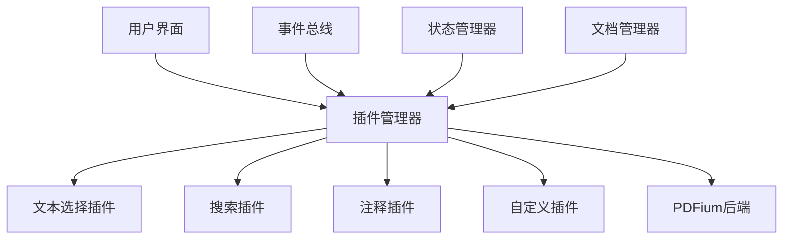
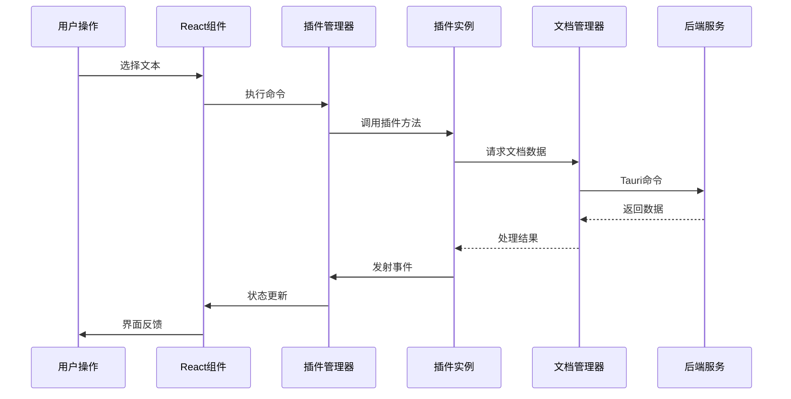

# PDF查看器插件系统总览

## 📋 目录
- [系统简介](#系统简介)
- [快速体验](#快速体验)
- [核心特性](#核心特性)
- [架构概览](#架构概览)
- [文档导航](#文档导航)
- [开发路线](#开发路线)

## 系统简介

PDF查看器插件系统是一个现代化的、可扩展的PDF处理架构，旨在通过插件化的方式提供丰富的PDF操作功能。系统采用事件驱动的设计模式，支持插件间的松耦合通信，为开发者提供了强大而灵活的扩展能力。

### 🎯 设计目标
- **模块化**: 功能解耦，易于维护和扩展
- **可扩展**: 通过插件系统轻松添加新功能
- **高性能**: 优化的渲染引擎和资源管理
- **开发友好**: 丰富的API和完善的文档
- **向后兼容**: 与现有系统无缝集成

## 快速体验

### 🚀 启动步骤

1. **启动应用**
   ```bash
   pnpm dev
   ```

2. **切换到插件版本**
   - 打开应用后，查看右上角的版本切换器
   - 默认已启用"插件架构版本 (V2)"
   - 左下角绿色指示器显示插件系统状态

3. **体验核心功能**
   - **文本选择**: 拖拽选择文本，支持跨页选择
   - **自动复制**: 选择完成后自动复制到剪贴板
   - **键盘快捷键**: `Escape` 清除选择
   - **开发者工具**: 按 `F12` 打开控制台查看插件信息

### 🔍 控制台体验

打开浏览器开发者工具，尝试以下命令：

```javascript
// 查看插件系统状态
console.log('已注册插件:', pluginManager.getRegisteredPlugins());
console.log('可用命令:', pluginManager.getPluginContext().getRegisteredCommands());

// 体验文本选择插件
const textPlugin = pluginManager.getPlugin('text-selection');
await textPlugin.selectText(0, 10, 0, 50); // 选择第1页的第10-50个字符

// 监听插件事件
pluginManager.getEventBus().on('text:selected', (event) => {
  console.log('选择了文本:', event.selection.text);
});
```

## 核心特性

### 🔌 插件架构


### 📡 事件驱动通信
- **事件总线**: 插件间松耦合通信
- **状态管理**: 统一的状态存储和订阅
- **命令系统**: 标准化的功能调用接口

### 🛠️ 开发者工具
- **实时调试**: 插件状态实时监控
- **性能分析**: 命令执行时间统计
- **错误处理**: 统一的错误捕获和报告

### 🔄 渐进式迁移
- **零破坏**: 现有功能完全保留
- **并行运行**: V1和V2版本可同时使用
- **平滑升级**: 逐步迁移现有功能

## 架构概览

### 📐 系统分层

```
┌─────────────────────────────────────────┐
│           React UI Layer                │  ← 用户界面组件
├─────────────────────────────────────────┤
│           Plugin System                 │  ← 插件管理和通信
├─────────────────────────────────────────┤
│          Core API Layer                 │  ← 文档管理和基础服务
├─────────────────────────────────────────┤
│         Tauri Commands                  │  ← IPC通信层
├─────────────────────────────────────────┤
│          Rust Backend                   │  ← PDFium集成
└─────────────────────────────────────────┘
```

### 🔧 核心组件

| 组件 | 职责 | 文件位置 |
|------|------|----------|
| **DocumentManager** | PDF文档生命周期管理 | `src/core/DocumentManager.ts` |
| **PluginManager** | 插件注册、依赖管理 | `src/core/PluginSystem.ts` |
| **EventBus** | 事件发布订阅 | `src/core/PluginSystem.ts` |
| **StateManager** | 全局状态管理 | `src/core/PluginSystem.ts` |
| **TextSelectionPlugin** | 文本选择功能 | `src/plugins/TextSelectionPlugin.ts` |

### 🔀 数据流



## 文档导航

### 📚 完整文档集

| 文档 | 描述 | 适用人群 |
|------|------|----------|
| **[插件架构设计](./plugin-architecture.md)** | 详细的技术架构和设计理念 | 架构师、高级开发者 |
| **[插件开发指南](./plugin-development-guide.md)** | 插件开发的完整教程 | 插件开发者 |
| **[插件使用指南](./plugin-usage-guide.md)** | 用户使用手册和配置指南 | 最终用户、集成者 |
| **[API参考文档](#)** | 详细的API接口文档 | 开发者 |

### 🎓 学习路径

#### 对于用户
1. 阅读 [插件使用指南](./plugin-usage-guide.md)
2. 体验内置插件功能
3. 学习自定义配置
4. 掌握故障排除方法

#### 对于开发者
1. 了解 [插件架构设计](./plugin-architecture.md)
2. 学习 [插件开发指南](./plugin-development-guide.md)
3. 创建第一个插件
4. 参与社区贡献

#### 对于架构师
1. 深入理解架构设计理念
2. 评估系统扩展性
3. 制定技术规范
4. 规划功能路线图

## 开发路线

### ✅ 已完成 (Phase 1)
- [x] 核心插件系统架构
- [x] 文档管理器实现
- [x] 事件总线和状态管理
- [x] 文本选择插件
- [x] 基础开发工具
- [x] 完整文档体系

### 🚧 进行中 (Phase 2)
- [ ] 搜索插件开发
- [ ] 注释系统插件
- [ ] 插件热重载支持
- [ ] 性能优化和监控
- [ ] 单元测试覆盖

### 📋 计划中 (Phase 3)
- [ ] 书签管理插件
- [ ] 表单填写插件
- [ ] 打印和导出插件
- [ ] 插件市场和分发
- [ ] 第三方插件SDK

### 🔮 未来展望 (Phase 4)
- [ ] 云端协作插件
- [ ] AI辅助功能
- [ ] 移动端适配
- [ ] 插件安全沙箱
- [ ] 企业级功能集成

## 🤝 参与贡献

### 贡献方式
- **Bug报告**: 通过Issue反馈问题
- **功能建议**: 提出新功能需求
- **代码贡献**: 提交Pull Request
- **文档改进**: 完善文档内容
- **插件开发**: 创建社区插件

### 开发环境
```bash
# 克隆项目
git clone <repository-url>
cd tauri-new-pdfium

# 安装依赖
pnpm install

# 启动开发服务器
pnpm dev

# 运行测试
pnpm test

# 构建项目
pnpm build
```

### 代码规范
- 使用TypeScript进行类型安全开发
- 遵循ESLint和Prettier配置
- 编写单元测试和集成测试
- 更新相关文档

## 📞 获取帮助

### 社区支持
- **GitHub Issues**: 技术问题和Bug报告
- **Discussions**: 功能讨论和经验分享
- **Wiki**: 社区维护的知识库

### 技术支持
- **开发者文档**: 详细的API和使用指南
- **示例代码**: 丰富的插件开发示例
- **最佳实践**: 经过验证的开发模式

---

## 🎉 开始探索

现在您已经了解了插件系统的基本概况，选择适合您的文档开始深入学习：

- 👤 **用户**: 从 [插件使用指南](./plugin-usage-guide.md) 开始
- 👨‍💻 **开发者**: 查看 [插件开发指南](./plugin-development-guide.md)
- 🏗️ **架构师**: 深入 [插件架构设计](./plugin-architecture.md)

让我们一起构建更强大、更灵活的PDF查看器生态系统！ 